   
  <h1>Sebastian Vargas</h1>
  <h3>Software Architect & Full Stack Developer</h3>
  

    <strong>Transforming complex requirements into high-performance digital ecosystems.</strong>  
    Specialized in scalable architectures, distributed systems, and cloud-native solutions.
  

  

    
    
    
  

### 🛠️ Technical Arsenal

| Frontend & Mobile | Backend & Runtime | Infrastructure & Tools |
| :--- | :--- | :--- |
|   |   |   |
|   |   |   |
|   |  |   |

 

### 🚀 Featured Projects

<table>
  <tr>
    <td width="50%">
      
       
      <a href="https://senddock.dev" target="_blank"><h3>SendDock</h3></a>
      
Open-source email marketing platform. Self-hostable, API-first, and designed for high throughput. Features a robust rate-limiting system and multi-provider support.

      

        
        
        
      

    </td>
    <td width="50%">
      
       
      <a href="https://ubiggo.arkhe.systems" target="_blank"><h3>Ubiggo</h3></a>
      
Enterprise-grade logistics and tracking platform under Arkhe Systems. Optimized for real-time data processing and scalable fleet management.

      

        
        
        
      

    </td>
  </tr>
  <tr>
    <td width="50%">
      
       
      <a href="https://github.com/JuansesDev" target="_blank"><h3>MTC - Modular Template CLI</h3></a>
      
Architecture-aware CLI for .NET. Automates the scaffolding of Clean Architecture and Vertical Slice patterns, ensuring consistency across enterprise projects.

      

        
        
        
      

    </td>
    <td width="50%">
      
       
      <a href="https://juansesdev.github.io/AerionOs/" target="_blank"><h3>AerionOS</h3></a>
      
Low-level OS simulation engine. Demonstrates advanced DOM manipulation, virtual file systems, and memory management concepts in the browser.

      

        
        
        
      

    </td>
  </tr>
</table>

 

### 📊 Git Analytics

  

  
  

  

